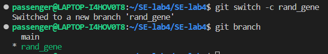
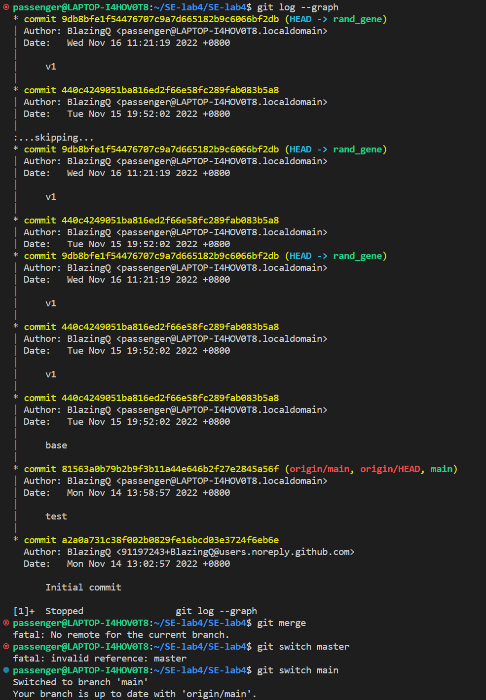
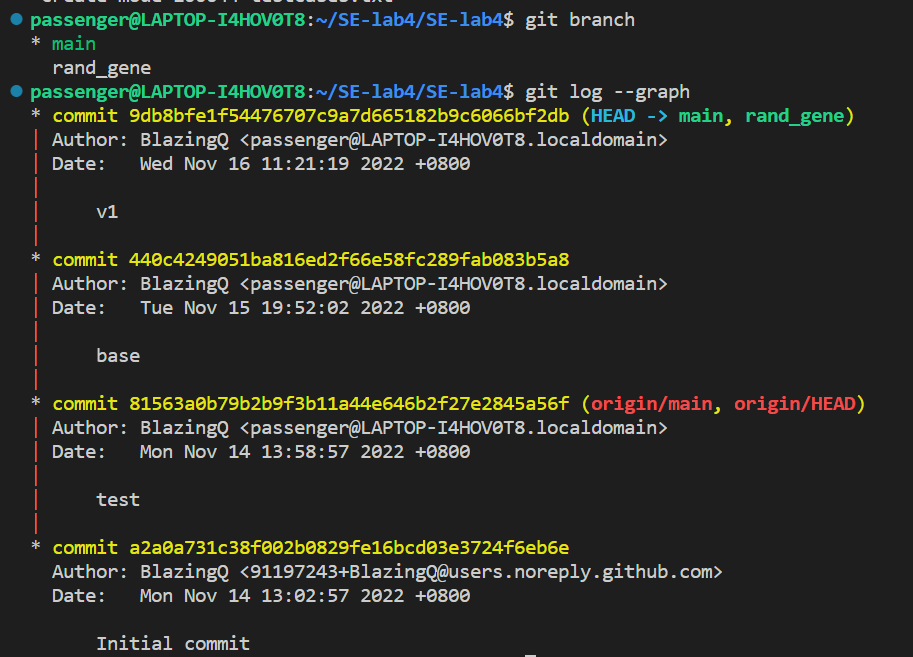

# LAB4 REPORT

201220051 钱子隽

**指导老师：张天 王豫**

2022.11.14

报告内容

在本地尝试暂存(add)、提交(commit)、回退(reset)等过程，在报告中简单展示你的操作，比如git命令的执行截图，并使用 git status 或 git diff 命令简单展示操作前后的区别

将整体项目划分为2个以上的子模块（例如，创建OJ输入、执行OJ程序、判断等价性等等），在本地为每个子模块创建一个分支(branch)，并在各分支上进行开发，最终将所有修改合并到 master 分支上；如有冲突请尝试解决。在报告中简单展示你的操作，并使用 git log --graph 命令展示分支合并图

与功能实现相关的关键代码的介绍，主要包括关键代码的功能介绍、运行流程、优秀设计等等

程序demo，例如执行程序的命令截图、输入输出结果截图等等

扩展：注册 github或gitee 账号，在账号中创建远程仓库 (权限请设置为 public)；把本地的所有分支推送到远端，在报告中展示远程仓库 (github or gitee) 的页面截图

扩展：如果同学们额外学习并实践了关于 git/github 的其他进阶操作 (如 merge 和 rebase 的区别、reset 和 revert 的区别、stash, cherry-pick 的使用等)，可在报告中展示

---

## 程序代码

总的头文件：judger.h

### 模块一：rand_gene

cpp文件为rand_gene.cpp

作用是根据给定的stdin_format.txt来生成随机的oj样例，并存储到指定文件中

函数：

```c++
void generatecase(string format, string outputfp);
```

### 模块二：exec_test

cpp文件为exec_test.cpp

作用是

## GIT部分



创建rand_gene分支来完成随机生成输入模块的开发

在rand_gene分支git commit之后：



合并分支：

```
git switch main
git merge rand_gene
```

之后再查看分支:



