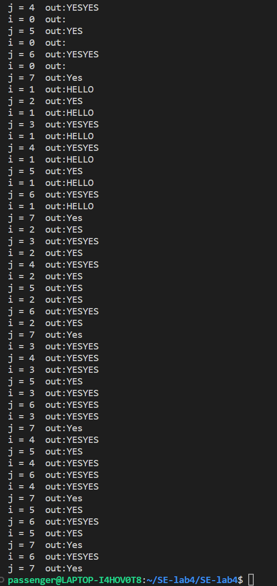
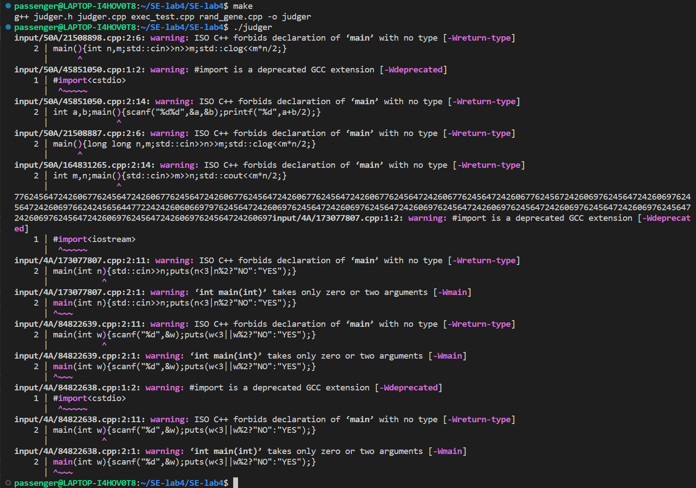
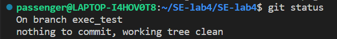
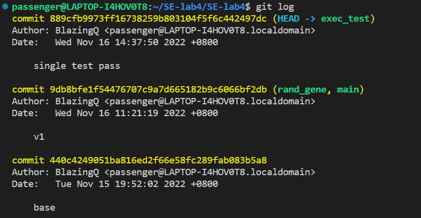
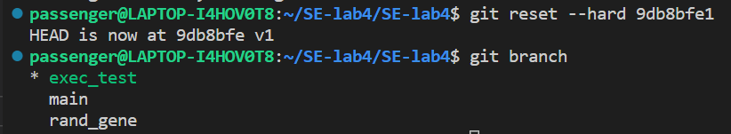
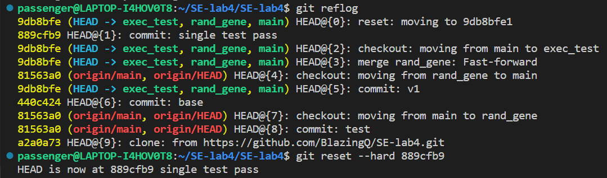
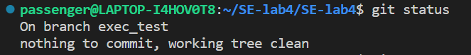
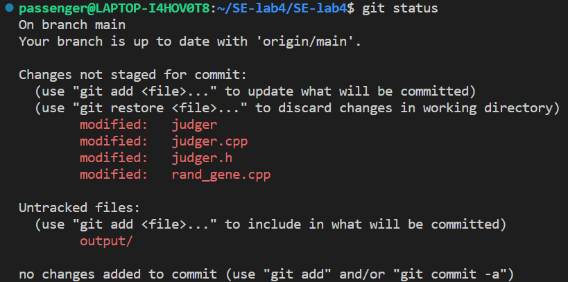
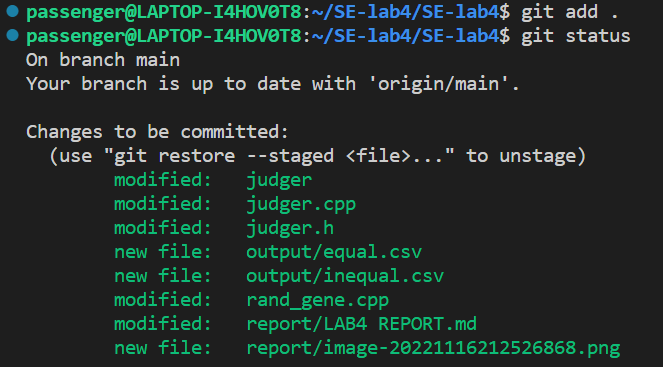
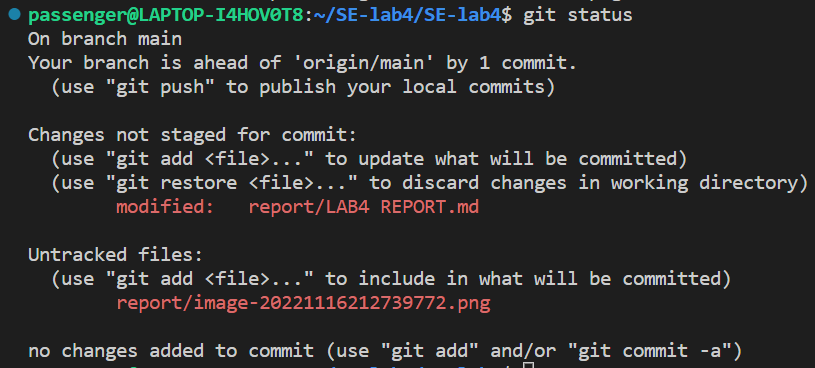

# LAB4 REPORT

201220051 钱子隽

**指导老师：张天 王豫**

2022.11.14

报告内容

在本地尝试暂存(add)、提交(commit)、回退(reset)等过程，在报告中简单展示你的操作，比如git命令的执行截图，并使用 git status 或 git diff 命令简单展示操作前后的区别

将整体项目划分为2个以上的子模块（例如，创建OJ输入、执行OJ程序、判断等价性等等），在本地为每个子模块创建一个分支(branch)，并在各分支上进行开发，最终将所有修改合并到 master 分支上；如有冲突请尝试解决。在报告中简单展示你的操作，并使用 git log --graph 命令展示分支合并图

与功能实现相关的关键代码的介绍，主要包括关键代码的功能介绍、运行流程、优秀设计等等

程序demo，例如执行程序的命令截图、输入输出结果截图等等

扩展：注册 github或gitee 账号，在账号中创建远程仓库 (权限请设置为 public)；把本地的所有分支推送到远端，在报告中展示远程仓库 (github or gitee) 的页面截图

扩展：如果同学们额外学习并实践了关于 git/github 的其他进阶操作 (如 merge 和 rebase 的区别、reset 和 revert 的区别、stash, cherry-pick 的使用等)，可在报告中展示

---

## 程序代码

总的头文件：judger.h

### 模块一：rand_gene

cpp文件为rand_gene.cpp

函数：

```c++
void generatecase(string format, string outputfp);
```

作用是根据给定的stdin_format.txt来生成随机的oj样例，并存储到指定文件中

```c++
	srand(time(NULL) + i);
    for(int i = 0; i != testvalues.size(); ++i)
    {
        tmp = testvalues[i];
        
        if(tmp.compare("char") == 0)
        {
            //cout<<"flag1\n";
            int randint = rand()%52;
            char randchar = alphabet[randint];
            ofs<<randchar<<' ';
        }
        else if(tmp.find("int") != -1)
        {
            int floor, ceiling;
            int lbracket = tmp.find('(');
            int comma = tmp.find(',');
            int rbracket = tmp.find(')');
            floor = stoi(tmp.substr(lbracket+1,comma - lbracket - 1));
            ceiling = stoi(tmp.substr(comma+1,rbracket - comma - 1));
            int randint = floor + rand()%(ceiling - floor + 1);
            ofs<<randint<<' ';
        }
        else if(tmp.find("string") != -1)
        {
            int floor, ceiling;
            int lbracket = tmp.find('(');
            int comma = tmp.find(',');
            int rbracket = tmp.find(')');
            floor = stoi(tmp.substr(lbracket+1,comma - lbracket - 1));
            ceiling = stoi(tmp.substr(comma+1,rbracket - comma - 1));
            int randint = floor + rand()%(ceiling - floor + 1);
            string randstr = "";
            for(int i = 0; i != randint; ++i)
            {
                randstr += alphabet[rand()%52];
            }
            ofs<<randstr<<' ';
        }
    }
```

没有采用多复杂的方法，就是对三种情况进行了讨论。随机采用rand（）伪随机，随机种子用time（）+参数i的方法（因为time按s来记尺度太大，很容易没有一点变化，出现重复测试用例）

子模块效果：

自己构造了一个stdin_format.txt：

```
int(1,5)
string(1,4)
char
```

重复执行，结果如下：

```
5 vr c 
3 SG E
2 eZ X
1 AIRW V 
2 X R 
```

### 模块二：exec_test

cpp文件为exec_test.cpp

函数：

```c++
void casetest(string fp1, string fp2, string testcasefp, string outp1, string outp2);
void geneexec(string fp);
```

geneexec函数通过内嵌shell语句，将给出的cpp文件编译成可执行文件供之后测试

```c++
void Judger::geneexec(string fp)
{
    string cmd = "g++ "+fp+" -o "+fp.substr(0, fp.size()-4);
    system(cmd.c_str());  
}
```

casetest函数根据给出的文件路径fp1和fp2，给出的测试用例的路径testcasefp，通过内嵌shell语句，将测试输入给可执行文件，并将结果导入路径outp1和outp2.

```c++
void Judger::casetest(string fp1, string fp2, string testcasefp, string outp1, string outp2)
{
    string cmd = "";
    cmd = fp1.substr(0, fp1.size()-4)+" <"+testcasefp+" >"+outp1;
    system(cmd.c_str());
    cmd = fp2.substr(0, fp2.size()-4)+" <"+testcasefp+" >"+outp2;
    system(cmd.c_str());
}
```

将此模块和模块一结合，加上获取文件夹目录的函数，写了比较简单的测试main函数，跑出如下测试结果，基本能进行自动化判断了：



### 模块三：main

cpp文件为judger.cpp

总体上是把上两个模块拼接，并且加上判断的逻辑，输出的逻辑。

读取文件夹目录函数有两个，一个是从根目录读取子文件夹，只舍弃".",".."目录

```c++
while((ptr = readdir(pDir))!=0) {
        string tmp = ptr->d_name;
        if (tmp.compare(".") != 0 && tmp.compare("..") != 0){
            filenames.push_back(path + "/" + ptr->d_name);
        }
    }
```

另一个只保留.cpp文件，用来挑出测试用例，以防发生意外。比如刚开始没有在结束的时候删去生成的可执行文件，会把这些文件也读进去，报错。

```c++
while((ptr = readdir(pDir))!=0) {
        string tmp = ptr->d_name;
        if (tmp.find("cpp") != -1){
            filenames.push_back(path + "/" + ptr->d_name);
        }
    }
```

判断两程序是否相等的逻辑为：将测试结果分别拼接成一个字符串。若字符串不同，即有一次测试不同就不等价，若多次随机测试字符串均相同，则等价。

对每个待测试的子文件夹，测试过程分三步：批量生成可执行文件、文件两两配对进行多次随机测试并根据测试结果当即给出判断写入equal.csv和inequal.csv、删除临时生成的可执行文件和.txt文件。分别在三个for循环中执行：

```c++
	for(int i = 0; i != foldernames.size(); ++i)
    {
        folder = foldernames[i];
        judger.GetFileNames(folder, filenames);
        format = folder + "/stdin_format.txt";
        for(int i = 0; i < filenames.size(); ++i)
        {
            judger.geneexec(filenames[i]);
        }
        for(int i = 0; i < filenames.size() - 1; ++i)
        {
            for(int j = i + 1; j < filenames.size(); ++j)
            {
                bool flag = 1;
                for(int k = 0; k != testtimes; ++k)
                {
                    judger.generatecase(format, "testcases.txt", k);
                    judger.casetest(filenames[i], filenames[j], "testcases.txt",
                    "out1.txt", "out2.txt");
                    string str1 = judger.ftos("out1.txt");
                    string str2 = judger.ftos("out2.txt");
                    if(str1.compare(str2) != 0)
                        flag = 0;
                }
                if(flag == 1)
                {
                    ofs1<<filenames[i]<<","<<filenames[j]<<"\n";
                }
                else if(flag == 0)
                {
                    ofs2<<filenames[i]<<","<<filenames[j]<<"\n";
                }
            }
        }
        for(int i = 0; i != filenames.size(); ++i)
        {
            judger.rmexec(filenames[i]);
        }
        filenames.clear();//important
    }
```

#### 优化

1. 本来我编译生成可执行文件也是在casetest函数中进行，导致会有$C_n^2$次编译过程，极大增加了程序跑一次的时间，后来改成一个.cpp只编译一次，运行时间被缩短到几秒钟。
2. 本来没有考虑删除文件，后来考虑到整体需要，通过内嵌shell指令在整体运行结束后把临时生成的文件全部删除，最终程序运行只会多出output文件夹和两个.csv文件。

## 程序DEMO

makefile文件：

```makefile
main:
	g++ judger.h judger.cpp exec_test.cpp rand_gene.cpp -o judger

clean:
	rm judger
```

指令：

```
make
./judger
```



warning是编译提供的.cpp文件的报错。

中间的一段随机数字是由于有些编译完成的程序不接受对应的测试用例，所以测试用例会被重定向输出到终端上。尝试去debug但是失败了。

最终的equal.csv和inequal.csv：

equal.csv：

```
file1,file2
input/50A/30534178.cpp,input/50A/138805414.cpp
input/50A/30534178.cpp,input/50A/21508898.cpp
input/50A/30534178.cpp,input/50A/21508887.cpp
input/50A/30534178.cpp,input/50A/142890373.cpp
input/50A/31034693.cpp,input/50A/36641065.cpp
input/50A/31034693.cpp,input/50A/33794240.cpp
input/50A/31034693.cpp,input/50A/29019948.cpp
input/50A/31034693.cpp,input/50A/21715601.cpp
input/50A/31034693.cpp,input/50A/164831265.cpp
input/50A/138805414.cpp,input/50A/21508898.cpp
input/50A/138805414.cpp,input/50A/21508887.cpp
input/50A/138805414.cpp,input/50A/142890373.cpp
input/50A/36641065.cpp,input/50A/33794240.cpp
input/50A/36641065.cpp,input/50A/29019948.cpp
input/50A/36641065.cpp,input/50A/21715601.cpp
input/50A/36641065.cpp,input/50A/164831265.cpp
input/50A/21508898.cpp,input/50A/21508887.cpp
input/50A/21508898.cpp,input/50A/142890373.cpp
input/50A/33794240.cpp,input/50A/29019948.cpp
input/50A/33794240.cpp,input/50A/21715601.cpp
input/50A/33794240.cpp,input/50A/164831265.cpp
input/50A/21508887.cpp,input/50A/142890373.cpp
input/50A/29019948.cpp,input/50A/21715601.cpp
input/50A/29019948.cpp,input/50A/164831265.cpp
input/50A/21715601.cpp,input/50A/164831265.cpp
input/4A/127473352.cpp,input/4A/134841308.cpp
input/4A/173077807.cpp,input/4A/84822639.cpp
input/4A/173077807.cpp,input/4A/84822638.cpp
input/4A/84822639.cpp,input/4A/84822638.cpp

```

inequal.csv：

```
file1,file2
input/50A/30534178.cpp,input/50A/31034693.cpp
input/50A/30534178.cpp,input/50A/36641065.cpp
input/50A/30534178.cpp,input/50A/45851050.cpp
input/50A/30534178.cpp,input/50A/33794240.cpp
input/50A/30534178.cpp,input/50A/29019948.cpp
input/50A/30534178.cpp,input/50A/21715601.cpp
input/50A/30534178.cpp,input/50A/164831265.cpp
input/50A/31034693.cpp,input/50A/138805414.cpp
input/50A/31034693.cpp,input/50A/21508898.cpp
input/50A/31034693.cpp,input/50A/45851050.cpp
input/50A/31034693.cpp,input/50A/21508887.cpp
input/50A/31034693.cpp,input/50A/142890373.cpp
input/50A/138805414.cpp,input/50A/36641065.cpp
input/50A/138805414.cpp,input/50A/45851050.cpp
input/50A/138805414.cpp,input/50A/33794240.cpp
input/50A/138805414.cpp,input/50A/29019948.cpp
input/50A/138805414.cpp,input/50A/21715601.cpp
input/50A/138805414.cpp,input/50A/164831265.cpp
input/50A/36641065.cpp,input/50A/21508898.cpp
input/50A/36641065.cpp,input/50A/45851050.cpp
input/50A/36641065.cpp,input/50A/21508887.cpp
input/50A/36641065.cpp,input/50A/142890373.cpp
input/50A/21508898.cpp,input/50A/45851050.cpp
input/50A/21508898.cpp,input/50A/33794240.cpp
input/50A/21508898.cpp,input/50A/29019948.cpp
input/50A/21508898.cpp,input/50A/21715601.cpp
input/50A/21508898.cpp,input/50A/164831265.cpp
input/50A/45851050.cpp,input/50A/33794240.cpp
input/50A/45851050.cpp,input/50A/21508887.cpp
input/50A/45851050.cpp,input/50A/29019948.cpp
input/50A/45851050.cpp,input/50A/142890373.cpp
input/50A/45851050.cpp,input/50A/21715601.cpp
input/50A/45851050.cpp,input/50A/164831265.cpp
input/50A/33794240.cpp,input/50A/21508887.cpp
input/50A/33794240.cpp,input/50A/142890373.cpp
input/50A/21508887.cpp,input/50A/29019948.cpp
input/50A/21508887.cpp,input/50A/21715601.cpp
input/50A/21508887.cpp,input/50A/164831265.cpp
input/50A/29019948.cpp,input/50A/142890373.cpp
input/50A/142890373.cpp,input/50A/21715601.cpp
input/50A/142890373.cpp,input/50A/164831265.cpp
input/4A/117364748.cpp,input/4A/48762087.cpp
input/4A/117364748.cpp,input/4A/127473352.cpp
input/4A/117364748.cpp,input/4A/173077807.cpp
input/4A/117364748.cpp,input/4A/84822639.cpp
input/4A/117364748.cpp,input/4A/134841308.cpp
input/4A/117364748.cpp,input/4A/84822638.cpp
input/4A/117364748.cpp,input/4A/101036360.cpp
input/4A/48762087.cpp,input/4A/127473352.cpp
input/4A/48762087.cpp,input/4A/173077807.cpp
input/4A/48762087.cpp,input/4A/84822639.cpp
input/4A/48762087.cpp,input/4A/134841308.cpp
input/4A/48762087.cpp,input/4A/84822638.cpp
input/4A/48762087.cpp,input/4A/101036360.cpp
input/4A/127473352.cpp,input/4A/173077807.cpp
input/4A/127473352.cpp,input/4A/84822639.cpp
input/4A/127473352.cpp,input/4A/84822638.cpp
input/4A/127473352.cpp,input/4A/101036360.cpp
input/4A/173077807.cpp,input/4A/134841308.cpp
input/4A/173077807.cpp,input/4A/101036360.cpp
input/4A/84822639.cpp,input/4A/134841308.cpp
input/4A/84822639.cpp,input/4A/101036360.cpp
input/4A/134841308.cpp,input/4A/84822638.cpp
input/4A/134841308.cpp,input/4A/101036360.cpp
input/4A/84822638.cpp,input/4A/101036360.cpp

```

## GIT部分

> 是一边试着验证git所学知识一边写代码的，看起来可能稍微有些乱。

创建rand_gene分支来完成随机生成输入模块的开发


在rand_gene分支git commit之后：


合并分支：

```
git switch main
git merge rand_gene
```

之后再查看分支:


创建新分支exec_test，在第三个分支下写了一些代码，git commit之后，查看git status：



使用git log查看上一次commit的版本号：



之后`git reset --hard 9db8bfe1`，回退到没有创建新分支的时候，代码回去了，但是分支没有变：



再借助git reflog查看历史git记录，找到最新的commit（此时git log看不到最新的那次了），把辛辛苦苦写的代码找回来了：



再次查看git status，仍处于干净的状态：



最后完成了基本内容的代码，发现还没在未git add和git commit情况下用git status。



git diff内容就很长了，是详细的所有被track内容的增删情况，还有不同分支的。

git add .后：



git commit后：



理应是完全干净的，但是我把报告也track了，所以有未被commit的部分。

### 扩展

创建了远端仓库，url：https://github.com/BlazingQ/SE-lab4

建立连接的指令：`git remote add origin https://github.com/BlazingQ/SE-lab4`

发生验证错误，关闭了ssl验证才连上了：`git config --global http.sslVerify false`

最后git push即可。

